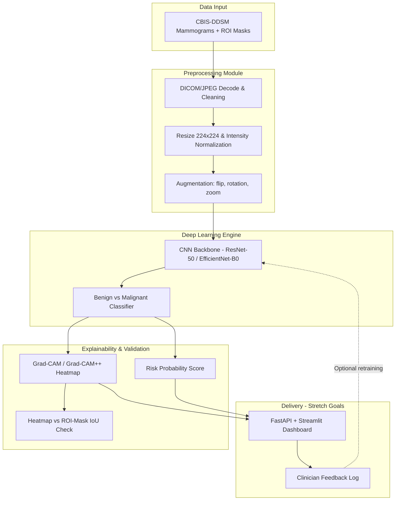

# Explainable Deep Learning Framework for Early Cancer Detection Using Medical Imaging

> **Scope decision (v2 — focused):** The system targets a **single modality: breast mammography**, using the **CBIS-DDSM** dataset (binary classification — *benign* vs. *malignant*). CBIS-DDSM ships with radiologist **ROI lesion masks**, which let us *quantitatively* validate explanations (Grad-CAM vs. expert annotation via **IoU**) — the core value of an "explainable" system. The pipeline is written **dataset-agnostically**, so **PatchCamelyon (PCam)** is a documented lightweight fallback if compute or dataset access is constrained.
>
> **Why one modality:** no single model handles CT + MRI + X-ray + histopathology well — they have completely different image statistics. Focusing yields a complete, defensible project instead of four half-finished ones.
>
> **Disclaimer:** This is a **research / educational prototype only**. It is **not a medical device and must not be used for clinical diagnosis.**

## 1. System Architecture

A single-modality pipeline: ingest mammograms, preprocess, classify benign/malignant, generate Grad-CAM heatmaps, and **validate those heatmaps against ground-truth ROI masks** for clinician-style review.



### Core (MVP) vs. Stretch
* **Core (must-build):** Data pipeline → baseline classifier → evaluation → Grad-CAM → verification & validation (including Grad-CAM-vs-ROI IoU).
* **Stretch (only if MVP lands early):** lesion localization, risk calibration, API + dashboard, feedback/retraining loop.

## 2. Proposed Directory Structure

This structure separates concerns, keeping data, experiments, source code, and deployment logic isolated.

```text
Explainable_DL_Cancer_Detection/
│
├── data/                      # Local data storage (git-ignored)
│   ├── raw/                   # CBIS-DDSM images + ROI masks (immutable)
│   ├── processed/             # Resized/normalized tensors, split manifests
│   └── sample/                # Tiny committed sample for CI / smoke tests
│
├── notebooks/                 # Jupyter notebooks for EDA and prototyping
│   ├── 01_data_exploration.ipynb
│   └── 02_baseline_model.ipynb
│
├── src/                       # Primary source code
│   ├── data/                  # Dataset, preprocessing, augmentation, quality checks
│   ├── models/                # Model definitions, trainer
│   ├── explainability/        # Grad-CAM / Grad-CAM++ (SHAP optional)
│   ├── evaluation/            # Metrics, evaluator, validation, IoU vs ROI masks
│   └── utils/                 # Config loader, logging, seeding
│
├── configs/                   # YAML config files for hyperparameters
│   └── default_config.yaml
│
├── tests/                     # Unit and integration tests
│
├── docs/                      # Documentation, traceability matrix, results
│
├── api/                       # (Stretch) FastAPI inference service
├── frontend/                  # (Stretch) Streamlit dashboard
│
├── train.py                   # CLI: train
├── evaluate.py                # CLI: evaluate
├── explain.py                 # CLI: single-image prediction + heatmap
├── requirements.txt           # Python dependencies
└── README.md                  # Project overview and setup instructions
```

## 3. Development Phases

Phases are ordered so each depends only on what came before. **Explainability is built before the consolidated Verification & Validation phase** (the original ordering tested Grad-CAM before it existed).

### Phase 0: Dataset Selection & Acquisition
* Download CBIS-DDSM (TCIA, or the JPEG-converted Kaggle mirror to avoid raw-DICOM pain).
* Build a **patient-wise** manifest CSV (`patient_id, image_path, roi_mask_path, label`); merge `BENIGN_WITHOUT_CALLBACK` → benign.
* Analyze class distribution up front (medical data is imbalanced).

### Phase 1: Data Pipeline & Verification
* Ingest mammograms (DICOM/JPEG → tensor), resize 224×224, intensity-normalize.
* Augmentations: flip, rotation, zoom (label-preserving).
* **Patient-wise, stratified** train/val/test split (no patient in two splits — avoids leakage).
* Unit tests: tensor shapes, value ranges ∈ [0,1], label integrity.

### Phase 2: Baseline Classification Model
* Pre-trained backbone (ResNet-50 / EfficientNet-B0) with a custom head; support layer freezing.
* Handle imbalance: **class weighting / Focal Loss**; Adam + LR scheduler, early stopping, checkpointing.
* Fix all random seeds; log config per run (reproducibility).

### Phase 3: Evaluation & Metrics
* Report **ROC-AUC *and* PR-AUC** (PR-AUC matters under imbalance), Sensitivity, Specificity, F1, confusion matrix.
* Compare against **published CBIS-DDSM baselines** rather than treating fixed thresholds as pass/fail gates.

### Phase 4: Explainability Engine
* Grad-CAM + Grad-CAM++ on the last conv layer; overlay heatmap on the mammogram.
* **SHAP is optional** — only worthwhile if tabular patient risk factors are added later (slow/less interpretable on raw pixels).

### Phase 5: Verification & Validation
* **Verification:** unit + integration tests, traceability matrix, data-quality checks.
* **Validation (quantitative, no live radiologists required):** **IoU / overlap of Grad-CAM vs. ground-truth ROI masks** that ship with CBIS-DDSM; K-Fold stability; metrics vs. published baselines.
* Optional qualitative review if a clinician is available — but the project does **not** depend on it.

### Phase 6+: Stretch
* Lesion localization (U-Net / bbox), risk calibration (temperature/Platt scaling), API + Streamlit dashboard, feedback-logging + retraining.

## 4. Compute & Reproducibility
* Training a ResNet-50/EfficientNet needs a GPU. Primary target: **free Colab/Kaggle GPU** (works on a Windows laptop without a local CUDA card). Downscale mammograms to 224×224 to keep memory manageable.
* Reproducibility: pin dependency versions, set global seeds, and log the exact config with every run (MLflow/W&B optional).

## 5. Data Ethics
* Use **de-identified public data only** (CBIS-DDSM/PCam are already de-identified).
* Carry the "not for clinical use" disclaimer into the README and dashboard.
